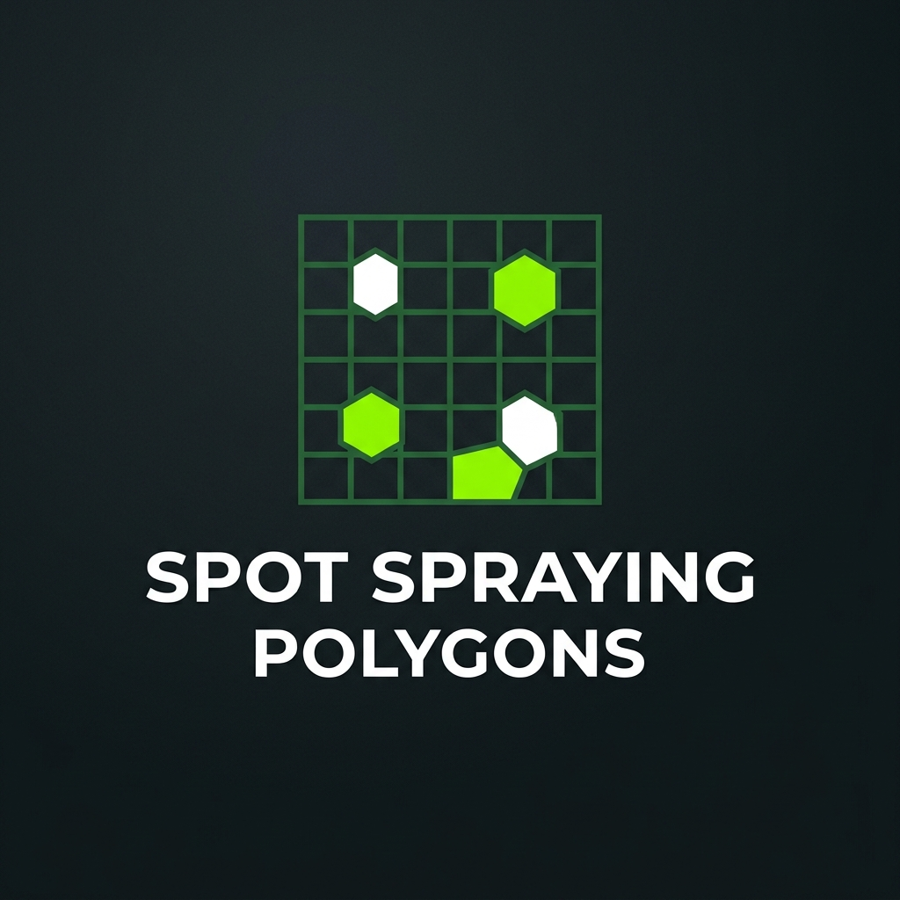

<a id="readme-top"></a>

<!-- PROJECT SHIELDS -->

[![Contributors][contributors-shield]][contributors-url]
[![Forks][forks-shield]][forks-url]
[![Stargazers][stars-shield]][stars-url]
[![Issues][issues-shield]][issues-url]
[![MIT License][license-shield]][license-url]
[![LinkedIn][linkedin-shield]][linkedin-url]

<!-- PROJECT LOGO -->
<br />
<div align="center">
  <a href="https://github.com/alissonpef/Spot-Spraying-Polygons">
    
  </a>

  <h3 align="center">Spot Spraying Polygons</h3>

  <p align="center">
    Automatic generation of georeferenced spraying polygons for localized weed management in precision agriculture.
    <br />
    <a href="https://github.com/alissonpef/Spot-Spraying-Polygons"><strong>Explore the docs »</strong></a>
    <br />
    <br />
    <a href="https://github.com/alissonpef/Spot-Spraying-Polygons/issues/new?labels=bug">Report Bug</a>
    &middot;
    <a href="https://github.com/alissonpef/Spot-Spraying-Polygons/issues/new?labels=enhancement">Request Feature</a>
  </p>
</div>

<!-- TABLE OF CONTENTS -->
<details>
  <summary>Table of Contents</summary>
  <ol>
    <li>
      <a href="#about-the-project">About The Project</a>
      <ul>
        <li><a href="#built-with">Built With</a></li>
      </ul>
    </li>
    <li>
      <a href="#getting-started">Getting Started</a>
      <ul>
        <li><a href="#prerequisites">Prerequisites</a></li>
        <li><a href="#installation">Installation</a></li>
      </ul>
    </li>
    <li><a href="#usage">Usage</a></li>
    <li><a href="#contributing">Contributing</a></li>
    <li><a href="#license">License</a></li>
    <li><a href="#contact">Contact</a></li>
  </ol>
</details>

<!-- ABOUT THE PROJECT -->

## About The Project

**Spot Spraying Polygons** is a tool designed to solve a crucial problem in modern agriculture: chemical product waste. Indiscriminate broadcast spraying generates financial loss and environmental damage. This tool converts georeferenced weed detection datasets into precise prescription maps, minimizing the treated area.

The processing pipeline includes:
- **Automatic UTM Projection**: Reprojects geographic coordinates (WGS84) to a local projected metric system (UTM), optimizing real-world measurements in meters.
- **Buffer & Clustering**: Expands the area of each weed detection based on a configurable safety margin and groups nearby spots to form coherent treatment patches.
- **9 Coverage Algorithms**: Offers smart geometric strategies (such as *Minimum Rotated Rectangle*, *Boustrophedon Cellular Decomposition*, *Fixed Grid*, *Quadtree*, *Strips*, among others) to adapt to different field shapes and application constraints.
- **Obstacle Avoidance**: Subtracts non-spray zones (trees, power lines, water bodies) with specific safety margins.
- **Universal Export**: Exports prescription maps in standard GeoJSON format, compatible with agricultural drones and sprayer controllers.
- **Line Routing & Metrics**: Generates zigzag spraying lines using shortest-path algorithms (Dijkstra) to connect passes, and provides a full efficiency report (IoU, turns, overspray waste).

The project includes a command-line interface (CLI) and an interactive web dashboard (Streamlit) for spatial step-by-step visualization.

<p align="right">(<a href="#readme-top">back to top</a>)</p>

### Built With

This section lists the main technologies, languages, and libraries that power the project.

* [![Python][Python-shield]][Python-url]
* [![Shapely][Shapely-shield]][Shapely-url]
* [![GeoPandas][GeoPandas-shield]][GeoPandas-url]
* [![Streamlit][Streamlit-shield]][Streamlit-url]
* [![Folium][Folium-shield]][Folium-url]
* [![NumPy][NumPy-shield]][NumPy-url]
* [![SciPy][SciPy-shield]][SciPy-url]
* [![Pandas][Pandas-shield]][Pandas-url]

<p align="right">(<a href="#readme-top">back to top</a>)</p>

<!-- GETTING STARTED -->

## Getting Started

To get a local copy up and running, follow these simple steps.

### Prerequisites

This project requires Python 3.11 or later. We highly recommend using the **uv** package manager for an extremely fast and isolated installation.

- Install **uv** (if you don't have it yet):
  ```sh
  pip install uv
  ```

### Installation

1. Clone the repository:
   ```sh
   git clone https://github.com/alissonpef/Spot-Spraying-Polygons.git
   cd Spot-Spraying-Polygons
   ```
2. Install dependencies and create a virtual environment with **uv**:
   ```sh
   uv sync
   ```
3. Activate the virtual environment:
   - **Linux/macOS**:
     ```sh
     source .venv/bin/activate
     ```
   - **Windows**:
     ```sh
     .venv\Scripts\activate
     ```

<p align="right">(<a href="#readme-top">back to top</a>)</p>

<!-- USAGE EXAMPLES -->

## Usage

The project supports both visual execution and terminal execution.

### Interactive Dashboard (Streamlit)

To launch the web visualization interface in your browser:
```sh
uv run streamlit run src/ui/app.py
```
*(or use the shortcut `uv run ui`)*

In the dashboard, you can upload your own GeoJSON files or use the samples located in the `data/` folder, adjust geometric parameters in real time, remove unwanted polygons directly on the map, and download the final GeoJSON.

### Command-Line Interface (CLI)

1. **Polygon Generation**:
   ```sh
   uv run spot-spray \
     --weeds data/input/weed1.geojson data/input/weed2.geojson \
     --fields data/input/fields.geojson \
     --obstacles data/input/obstacles.geojson \
     --output data/output/spraying-mrr.geojson \
     --coverage_method mrr \
     --weed_buffer_m 1.5 \
     --merge_distance_m 8.0
   ```

2. **Spraying Line Generation**:
   ```sh
   uv run spraying-lines data/output/spraying-mrr.geojson 2.0 0.0 --output-dir data/output/lines
   ```

3. **Run Metrics Suite**:
   ```sh
   uv run metrics
   ```

<p align="right">(<a href="#readme-top">back to top</a>)</p>

<!-- CONTRIBUTING -->

## Contributing

Contributions are what make the open-source community such an amazing place to learn, inspire, and create. Any contributions you make are **greatly appreciated**.

If you have a suggestion that would make this better, please fork the repository and create a pull request. You can also simply open an issue with the tag "enhancement".

1. Fork the Project
2. Create your Feature Branch (`git checkout -b feature/AmazingFeature`)
3. Commit your Changes (`git commit -m 'Add some AmazingFeature'`)
4. Push to the Branch (`git push origin feature/AmazingFeature`)
5. Open a Pull Request

### Top Contributors:

<a href="https://github.com/alissonpef/Spot-Spraying-Polygons/graphs/contributors">
  
</a>

<p align="right">(<a href="#readme-top">back to top</a>)</p>

<!-- LICENSE -->

## License

Distributed under the MIT License. See [LICENSE](LICENSE) for more information.

<p align="right">(<a href="#readme-top">back to top</a>)</p>

<!-- CONTACT -->

## Contact

Alisson Pereira Ferreira - alissonpef@gmail.com - [LinkedIn](https://www.linkedin.com/in/alisson-pereira-ferreira/)

Project Link: [https://github.com/alissonpef/Spot-Spraying-Polygons](https://github.com/alissonpef/Spot-Spraying-Polygons)

<p align="right">(<a href="#readme-top">back to top</a>)</p>

---

Made with ❤️ by **Alisson Pereira**.

<!-- MARKDOWN LINKS & IMAGES -->
[contributors-shield]: https://img.shields.io/github/contributors/alissonpef/Spot-Spraying-Polygons.svg?style=for-the-badge
[contributors-url]: https://github.com/alissonpef/Spot-Spraying-Polygons/graphs/contributors
[forks-shield]: https://img.shields.io/github/forks/alissonpef/Spot-Spraying-Polygons.svg?style=for-the-badge
[forks-url]: https://github.com/alissonpef/Spot-Spraying-Polygons/network/members
[stars-shield]: https://img.shields.io/github/stars/alissonpef/Spot-Spraying-Polygons.svg?style=for-the-badge
[stars-url]: https://github.com/alissonpef/Spot-Spraying-Polygons/stargazers
[issues-shield]: https://img.shields.io/github/issues/alissonpef/Spot-Spraying-Polygons.svg?style=for-the-badge
[issues-url]: https://github.com/alissonpef/Spot-Spraying-Polygons/issues
[license-shield]: https://img.shields.io/github/license/alissonpef/Spot-Spraying-Polygons.svg?style=for-the-badge
[license-url]: https://github.com/alissonpef/Spot-Spraying-Polygons/blob/main/LICENSE
[linkedin-shield]: https://img.shields.io/badge/-LinkedIn-black.svg?style=for-the-badge&logo=linkedin&colorB=555
[linkedin-url]: https://www.linkedin.com/in/alisson-pereira-ferreira/

[Python-shield]: https://img.shields.io/badge/Python-3776AB?style=for-the-badge&logo=python&logoColor=white
[Python-url]: https://www.python.org/
[Shapely-shield]: https://img.shields.io/badge/Shapely-2E8B57?style=for-the-badge
[Shapely-url]: https://shapely.readthedocs.io/
[GeoPandas-shield]: https://img.shields.io/badge/GeoPandas-139C5A?style=for-the-badge
[GeoPandas-url]: https://geopandas.org/
[Streamlit-shield]: https://img.shields.io/badge/Streamlit-FF4B4B?style=for-the-badge&logo=streamlit&logoColor=white
[Streamlit-url]: https://streamlit.io/
[Folium-shield]: https://img.shields.io/badge/Folium-77B829?style=for-the-badge
[Folium-url]: https://python-visualization.github.io/folium/
[NumPy-shield]: https://img.shields.io/badge/NumPy-013243?style=for-the-badge&logo=numpy&logoColor=white
[NumPy-url]: https://numpy.org/
[SciPy-shield]: https://img.shields.io/badge/SciPy-8CAAE6?style=for-the-badge&logo=scipy&logoColor=white
[SciPy-url]: https://scipy.org/
[Pandas-shield]: https://img.shields.io/badge/Pandas-150458?style=for-the-badge&logo=pandas&logoColor=white
[Pandas-url]: https://pandas.pydata.org/